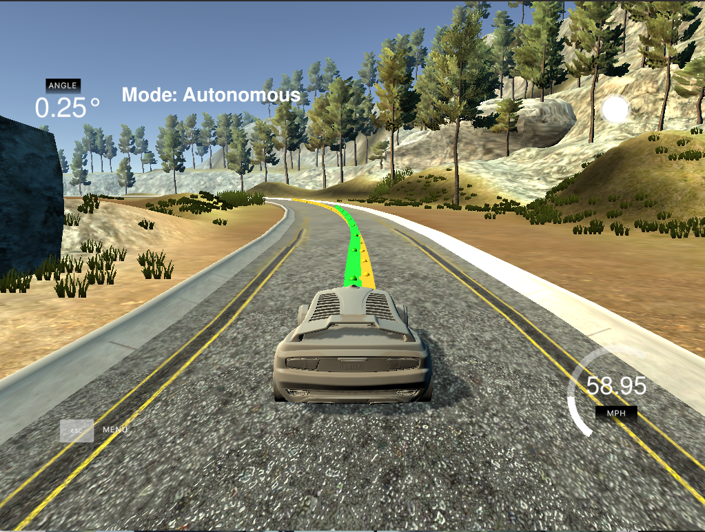

# CarND-Controls-MPC
Self-Driving Car Engineer Nanodegree Program

---
## Intro
This repository is about my solution to the Udacity SDCND MPC Project.See picture below.

This solution,as the lessons suggest, makes use of the IPOPT and CPPAD libraries to calculate an optimal trajectory and its associated actuation commands in order to minimize error with a third-degree polynomial fit to the given waypoints. The optimization considers only a short duration's worth of waypoints, and produces a trajectory for that duration based upon a model of the vehicle's kinematics and a cost function based mostly on the vehicle's cross-track error (roughly the distance from the track waypoints) and orientation angle error,with other cost factors included to improve performance.

## Rubric Points
### The model-- Student describes their model in detail. This includes the state,actuators and update equations.
- x:The x position of the vehicle.
- y:The y position of the vehicle.
- psi:The orientation of the vehicle.
- v:The current velocity.
- cte: The Cross-Track-Error.
- epsi: The orientation error.

```
The Update equation is following:
x[t+1] = x[t] + v[t] * cos(psi[t]) * dt
y[t+1] = y[t] + v[t] * sin(psi[t]) * dt
psi[t+1] = psi[t] + v[t] / Lf * delta[t] * dt
v[t+1] = v[t] + a[t] * dt
cte[t+1] = f(x[t]) - y[t] + v[t] * sin(epsi[t]) * dt
epsi[t+1] = psi[t] - psides[t] + v[t] * delta[t] / Lf * d
```
### Timestep Length and Elapsed Duration (N & dt)-- Student discusses the reasoning behind the chosen N (timestep length) and dt (elapsed duration between timesteps) values.Additionally the student details the previous values tried.

After several tryout,finally I changed the values to N = 10 and dt  = 0.1 instead of initial value N = 20 and dt = 0.01.
- If dt is too large, the calculation error would increase.If it was too small, the trajectory calculation may take too long.
- Because we use 100ms latency,so I choose the larger value to deal with the latency.
- Smaller value than N=10 is not enough to calculate the trajectory.

### Polynomial Fitting and MPC Preprocessing.
The waypoints provided by the simulator are prepocessed by transorming them from the world's to vehicle's reference frame(see lines 107-113).Then they are fed to the polyfit function to find coefficients of a 3rd order polynomial.

### Model Predictive Control with Latency.
When dealing with the latency, I choose dt=0.1. And, I also incorporated latency into the model.
```
fg[1 + x_start + i] = x_1 - (x_0 + v_0 * CppAD::cos(psi_0) * dt);
fg[1 + y_start + i] = y_1 - (y_0 + v_0 * CppAD::sin(psi_0) * dt);
fg[1 + psi_start + i] = psi_1 - (psi_0 - v_0/Lf * delta * dt);
fg[1 + v_start + i] = v_1 - (v_0 + a * dt);
fg[1 + cte_start + i] = cte_1 - ((f_0 - y_0) + (v_0 * CppAD::sin(epsi_0) * dt));
fg[1 + epsi_start + i] = epsi_1 - ((psi_0 - psides_0) - v_0/Lf * delta * dt);
```


## Dependencies

* cmake >= 3.5
 * All OSes: [click here for installation instructions](https://cmake.org/install/)
* make >= 4.1(mac, linux), 3.81(Windows)
  * Linux: make is installed by default on most Linux distros
  * Mac: [install Xcode command line tools to get make](https://developer.apple.com/xcode/features/)
  * Windows: [Click here for installation instructions](http://gnuwin32.sourceforge.net/packages/make.htm)
* gcc/g++ >= 5.4
  * Linux: gcc / g++ is installed by default on most Linux distros
  * Mac: same deal as make - [install Xcode command line tools]((https://developer.apple.com/xcode/features/)
  * Windows: recommend using [MinGW](http://www.mingw.org/)
* [uWebSockets](https://github.com/uWebSockets/uWebSockets)
  * Run either `install-mac.sh` or `install-ubuntu.sh`.
  * If you install from source, checkout to commit `e94b6e1`, i.e.
    ```
    git clone https://github.com/uWebSockets/uWebSockets
    cd uWebSockets
    git checkout e94b6e1
    ```
    Some function signatures have changed in v0.14.x. See [this PR](https://github.com/udacity/CarND-MPC-Project/pull/3) for more details.

* **Ipopt and CppAD:** Please refer to [this document](https://github.com/udacity/CarND-MPC-Project/blob/master/install_Ipopt_CppAD.md) for installation instructions.
* [Eigen](http://eigen.tuxfamily.org/index.php?title=Main_Page). This is already part of the repo so you shouldn't have to worry about it.
* Simulator. You can download these from the [releases tab](https://github.com/udacity/self-driving-car-sim/releases).
* Not a dependency but read the [DATA.md](./DATA.md) for a description of the data sent back from the simulator.


## Basic Build Instructions

1. Clone this repo.
2. Make a build directory: `mkdir build && cd build`
3. Compile: `cmake .. && make`
4. Run it: `./mpc`.

## Tips

1. It's recommended to test the MPC on basic examples to see if your implementation behaves as desired. One possible example
is the vehicle starting offset of a straight line (reference). If the MPC implementation is correct, after some number of timesteps
(not too many) it should find and track the reference line.
2. The `lake_track_waypoints.csv` file has the waypoints of the lake track. You could use this to fit polynomials and points and see of how well your model tracks curve. NOTE: This file might be not completely in sync with the simulator so your solution should NOT depend on it.
3. For visualization this C++ [matplotlib wrapper](https://github.com/lava/matplotlib-cpp) could be helpful.)
4.  Tips for setting up your environment are available [here](https://classroom.udacity.com/nanodegrees/nd013/parts/40f38239-66b6-46ec-ae68-03afd8a601c8/modules/0949fca6-b379-42af-a919-ee50aa304e6a/lessons/f758c44c-5e40-4e01-93b5-1a82aa4e044f/concepts/23d376c7-0195-4276-bdf0-e02f1f3c665d)
5. **VM Latency:** Some students have reported differences in behavior using VM's ostensibly a result of latency.  Please let us know if issues arise as a result of a VM environment.

## Editor Settings

We've purposefully kept editor configuration files out of this repo in order to
keep it as simple and environment agnostic as possible. However, we recommend
using the following settings:

* indent using spaces
* set tab width to 2 spaces (keeps the matrices in source code aligned)

## Code Style

Please (do your best to) stick to [Google's C++ style guide](https://google.github.io/styleguide/cppguide.html).

## Project Instructions and Rubric

Note: regardless of the changes you make, your project must be buildable using
cmake and make!

More information is only accessible by people who are already enrolled in Term 2
of CarND. If you are enrolled, see [the project page](https://classroom.udacity.com/nanodegrees/nd013/parts/40f38239-66b6-46ec-ae68-03afd8a601c8/modules/f1820894-8322-4bb3-81aa-b26b3c6dcbaf/lessons/b1ff3be0-c904-438e-aad3-2b5379f0e0c3/concepts/1a2255a0-e23c-44cf-8d41-39b8a3c8264a)
for instructions and the project rubric.

## Hints!

* You don't have to follow this directory structure, but if you do, your work
  will span all of the .cpp files here. Keep an eye out for TODOs.

## Call for IDE Profiles Pull Requests

Help your fellow students!

We decided to create Makefiles with cmake to keep this project as platform
agnostic as possible. Similarly, we omitted IDE profiles in order to we ensure
that students don't feel pressured to use one IDE or another.

However! I'd love to help people get up and running with their IDEs of choice.
If you've created a profile for an IDE that you think other students would
appreciate, we'd love to have you add the requisite profile files and
instructions to ide_profiles/. For example if you wanted to add a VS Code
profile, you'd add:

* /ide_profiles/vscode/.vscode
* /ide_profiles/vscode/README.md

The README should explain what the profile does, how to take advantage of it,
and how to install it.

Frankly, I've never been involved in a project with multiple IDE profiles
before. I believe the best way to handle this would be to keep them out of the
repo root to avoid clutter. My expectation is that most profiles will include
instructions to copy files to a new location to get picked up by the IDE, but
that's just a guess.

One last note here: regardless of the IDE used, every submitted project must
still be compilable with cmake and make./

## How to write a README
A well written README file can enhance your project and portfolio.  Develop your abilities to create professional README files by completing [this free course](https://www.udacity.com/course/writing-readmes--ud777).
# CarND-MPC-Project
# CarND-MPC-Project
